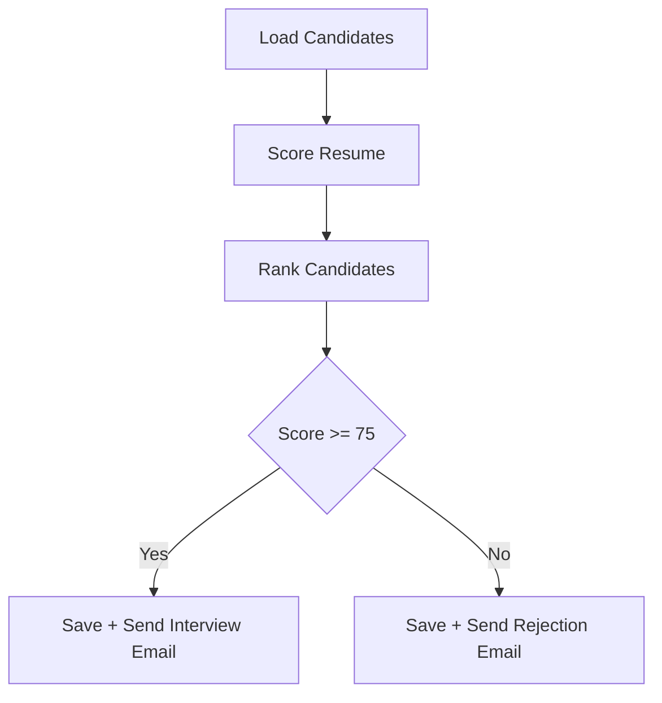
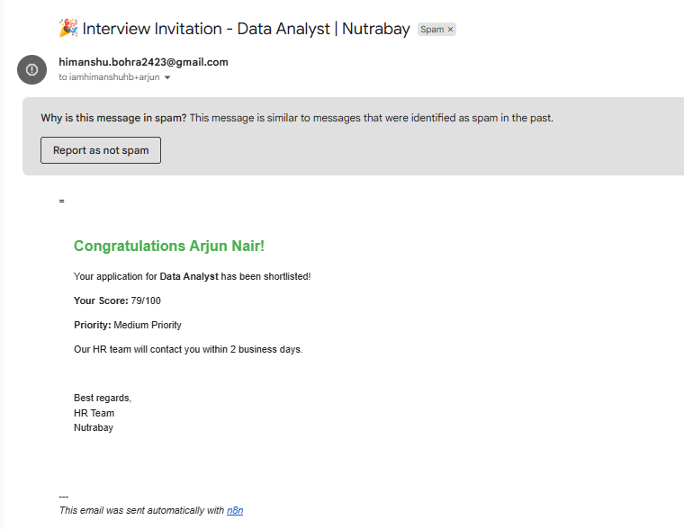
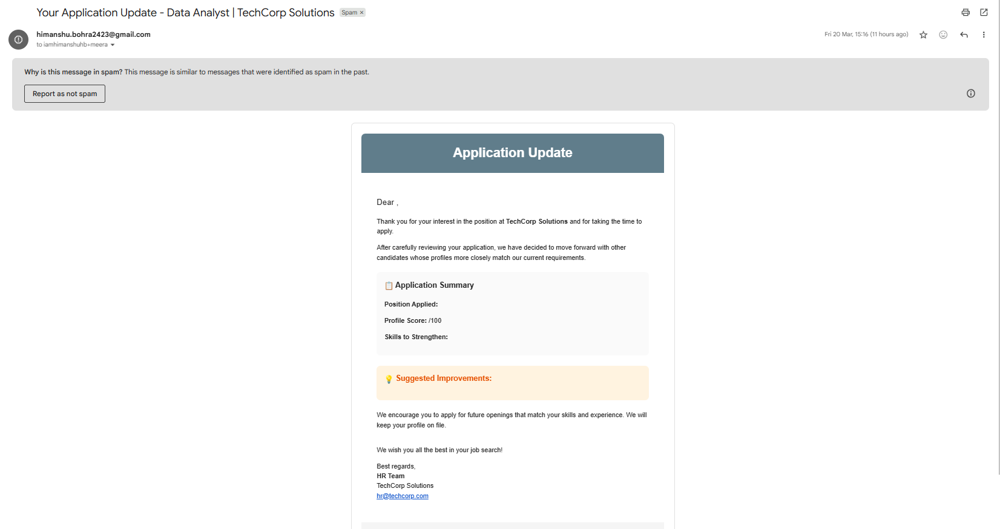

#  AI Resume Screening System using n8n

>  Fully automated hiring workflow — no downloads required. Explore everything directly in this repository.

---

##  Overview

This project is an **automated resume screening system** built using **n8n (self-hosted with Docker)**.

It evaluates candidates, ranks them, and automates hiring decisions such as:

* Shortlisting candidates
* Sending interview emails
* Sending rejection emails
* Storing results in Google Sheets

---

##  Live Demo

###  Candidate Dashboard (Real-Time)

 **[Open Live Dashboard]([https://docs.google.com/spreadsheets/d/e/2PACX-1vTsc0SQ6f9jYCA1oq17TznqNB92x6KI3iY5YLogoFDr-lmjHlad_I0JajhrM6Wycm7ATIgTsw6mJlz/pubhtml](https://docs.google.com/spreadsheets/d/e/2PACX-1vTsc0SQ6f9jYCA1oq17TznqNB92x6Kl3iY5YL0goFDr-lmjHIad_Il0JajhrM6Wycm7ATlgTsw6mJlz/pubhtml?widget=true&amp;headers=false))**

>  This sheet updates automatically from the n8n workflow

---

##  Workflow File

 **[View Workflow JSON](workflow/Resume_Screening.json)**

---

##  How It Works



---

##  Features

*  Resume scoring using keyword matching (JavaScript logic)
*  Candidate ranking system
*  Google Sheets integration (live results)
*  Automated email system (Gmail API)
*  Fully automated workflow (n8n)
*  Runs locally using Docker
*  No paid APIs used

---

##  Tech Stack

* n8n
* Docker
* JavaScript
* Google Sheets API
* Gmail API
* OAuth2
* ngrok

---

##  Sample Output

| Candidate    | Score | Status   |
| ------------ | ----- | -------- |
| Priya Sharma | 84    | Selected |
| Rahul Verma  | 65    | Rejected |

---

##  Repository Structure

```
workflow/
docs/
.env.example
.gitignore
README.md
```

---

##  Email Templates
###  Accepted Candidate



---

###  Rejected Candidate



---

##  Setup Guide

 **[View Setup Instructions](docs/setup_guide.md)**

 ## Author

Himanshu  
 Email: himanshu.bohra2423@gmail.com <br>
 LinkedIn: https://www.linkedin.com/in/himanshubohra24/ 
